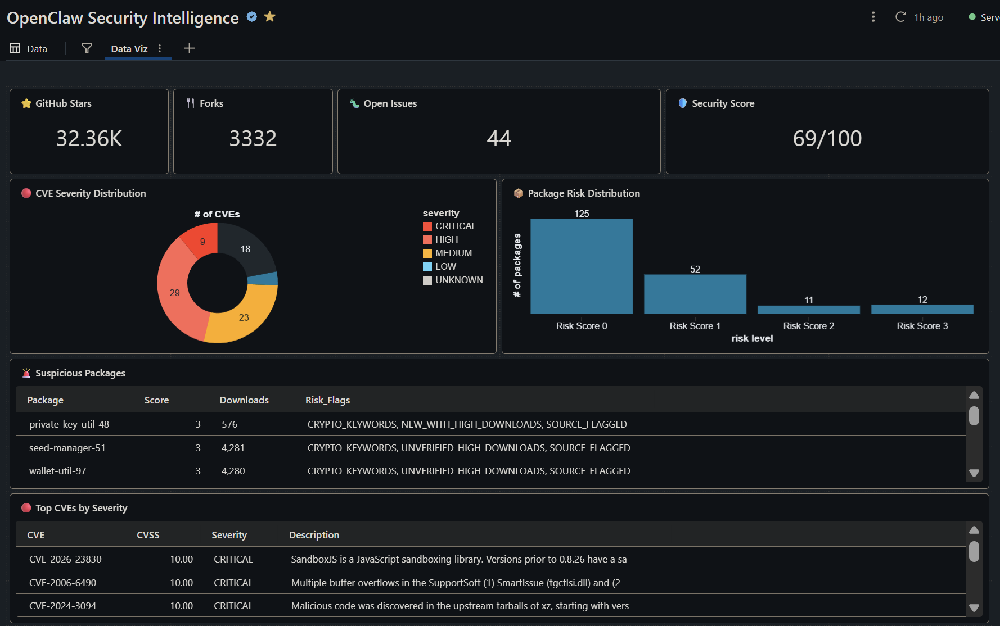
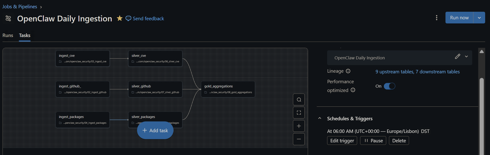

# OpenClaw Security Intelligence Lakehouse

> Daily security analytics for the OpenClaw AI agent ecosystem, built as a medallion lakehouse on Databricks

[](https://github.com/pedro-mesquita7/openclaw-security-lakehouse/actions/workflows/ci.yml)
[](https://databricks.com)
[](https://python.org)
[](LICENSE)



## Problem Statement

[OpenClaw](https://github.com/openclaw/openclaw) is an AI agent framework that gained **32,000+ GitHub stars** very quickly. Growth like that brings security risk: third-party extension packages from unverified publishers, a growing CVE surface, and very little tooling to monitor either.

This project builds the monitoring layer: it ingests repository activity and vulnerability data every day, tracks how packages change over time, scores risk, and serves it all on a single dashboard.

### Data sources

| Source | Data | Real or simulated |
|--------|------|-------------------|
| GitHub REST API | Stars, forks, issues, releases, contributors | **Real** (live API) |
| NIST NVD API | CVE records with CVSS scores | **Real** (live API) |
| Package registry | Package metadata, publishers, downloads | **Simulated.** The registry had no public API when this was built, so `04_ingest_packages.py` generates realistic snapshots (every row is flagged `_synthetic = true`). The risk-scoring and SCD Type 2 logic is the same either way. |

## Dashboard Preview

The project includes a security dashboard showing:
- **Security Score**: Overall health metric (0-100)
- **CVE Severity Distribution**: CRITICAL, HIGH, MEDIUM, LOW breakdown
- **Package Risk Distribution**: Packages by risk score
- **Suspicious Packages Table**: Flagged packages with risk indicators
- **Top CVEs**: Highest severity vulnerabilities

## Automated Pipeline

The entire data pipeline runs automatically via Databricks Workflows:



**Daily Schedule:**
- Ingests fresh data from GitHub and NVD (Bronze layer)
- Rebuilds Silver tables with SCD Type 2 history tracking
- Recalculates Gold aggregations and security scores
- Dashboard auto-refreshes to show latest data

## Architecture

This project implements a **medallion architecture** (Bronze -> Silver -> Gold) using Delta Lake:

```
┌─────────────────────────────────────────────────────────────────┐
│                     External Data Sources                        │
├─────────────────────┬─────────────────┬────────────────────────┤
│     GitHub API      │     NVD API     │   Package Registry     │
└──────────┬──────────┴────────┬────────┴───────────┬────────────┘
           │                   │                    │
           ▼                   ▼                    ▼
┌─────────────────────────────────────────────────────────────────┐
│                      BRONZE (Raw Data)                          │
│  • github_repository_raw    • cve_raw                           │
│  • github_issues_raw        • packages_raw                      │
│  • github_releases_raw      • github_contributors_raw           │
└─────────────────────────────────────────────────────────────────┘
                              │
                              ▼
┌─────────────────────────────────────────────────────────────────┐
│                     SILVER (Cleaned)                            │
│  • packages (with risk flags)    • cve_details                  │
│  • packages_scd (SCD Type 2)     • github_repo_metrics          │
│  • github_issues                 • github_releases              │
└─────────────────────────────────────────────────────────────────┘
                              │
                              ▼
┌─────────────────────────────────────────────────────────────────┐
│                       GOLD (Analytics)                          │
│  • daily_security_summary    • suspicious_packages              │
│  • package_risk_scores       • Security Dashboard               │
└─────────────────────────────────────────────────────────────────┘
```

## Tech Stack

| Component | Technology |
|-----------|------------|
| **Platform** | Databricks (Community/Free Edition compatible) |
| **Table Format** | Delta Lake |
| **Processing** | PySpark + Databricks SQL |
| **IaC** | Databricks Asset Bundles (DABs) |
| **CI/CD** | GitHub Actions |
| **Containerization** | Docker |
| **Languages** | Python 3.11, SQL |

## Key Features

### Medallion Architecture
- **Bronze**: Raw JSON from APIs with full fidelity preservation
- **Silver**: Cleaned, typed, deduplicated records with risk flags
- **Gold**: Business-ready aggregations and security metrics

### Delta Lake Features Demonstrated
- **Schema Evolution**: Gracefully handle API changes
- **Time Travel**: Query historical states for incident investigation
- **ACID Transactions**: Reliable data updates
- **SCD Type 2**: Track package metadata changes over time

### Shared Module Architecture
Notebooks import from reusable modules in `src/utils/`:
- **`api_clients.py`**: Rate-limited API clients (GitHub, NVD) with retry logic
- **`data_quality.py`**: DQ assertion framework for pipeline validation

### SCD Type 2 Implementation
The `packages_scd` table maintains full history of package changes:
```sql
-- Point-in-time query: What was the state on a specific date?
SELECT * FROM openclaw_security.packages_scd
WHERE package_id = 'pkg_001'
  AND valid_from <= '2024-06-15'
  AND (valid_to > '2024-06-15' OR valid_to IS NULL);
```

### Security Analytics
- **Package Risk Scoring**: Multi-factor risk assessment
  - `CRYPTO_KEYWORDS`: Detects crypto/wallet/seed/mnemonic patterns
  - `UNVERIFIED_HIGH_DOWNLOADS`: Unverified publishers with 3000+ downloads
  - `SHORT_DESCRIPTION`: Suspiciously brief descriptions
  - `NEW_WITH_HIGH_DOWNLOADS`: Rapid adoption of new packages
  - `SOURCE_FLAGGED`: Pre-flagged by source system
- **CVE Tracking**: Severity-based vulnerability monitoring
- **Anomaly Detection**: Identify potentially malicious packages

## Sample Run Results

Figures from the run shown in the dashboard screenshot (package figures come from the simulated registry, so they change between runs):

| Metric | Value |
|--------|-------|
| GitHub Stars | 32,361 |
| Forks | 3,332 |
| Open Issues | 44 |
| Packages Scored | 200 |
| Security Score | 69/100 |

## Quick Start

### Prerequisites
- Docker & Docker Compose
- Databricks account (Free Edition works)
- API keys: GitHub (optional but recommended), NVD (optional)

### Setup

1. **Clone the repository**
   ```bash
   git clone https://github.com/pedro-mesquita7/openclaw-security-lakehouse.git
   cd openclaw-security-lakehouse
   ```

2. **Configure environment**
   ```bash
   cp .env.example .env
   # Edit .env with your API keys and Databricks credentials
   ```

3. **Start development container**
   ```bash
   docker-compose build
   docker-compose run --rm dev
   ```

4. **Configure Databricks CLI** (inside container)
   ```bash
   databricks configure --token
   # Enter your Databricks host and token
   ```

5. **Create secrets** (optional, for API keys)
   ```bash
   databricks secrets create-scope openclaw
   databricks secrets put-secret openclaw github_token --string-value "$GITHUB_TOKEN"
   databricks secrets put-secret openclaw nvd_api_key --string-value "$NVD_API_KEY"
   ```

6. **Import and run notebooks** in Databricks UI (in order):
   ```
   01_setup_schema.py       -> Creates database schema
   02_ingest_github.py      -> Fetches GitHub data
   03_ingest_cve.py         -> Fetches CVE data from NVD
   04_ingest_packages.py    -> Generates simulated package registry data
   05_silver_packages.py    -> Transforms packages with SCD Type 2
   06_silver_cve.py         -> Transforms CVE records
   07_silver_github.py      -> Transforms GitHub data
   08_gold_aggregations.py  -> Creates analytics tables
   ```

7. **Build dashboard** using queries in `dashboards/` folder

## Project Structure

```
openclaw-security-lakehouse/
├── databricks.yml              # DAB configuration
├── docker-compose.yml          # Development container
├── pyproject.toml              # Python project config
├── requirements.txt
├── .env.example                # Environment template
│
├── notebooks/                  # Databricks notebooks (execution layer)
│   ├── 01_setup_schema.py
│   ├── 02_ingest_github.py     # Uses src/utils/api_clients.py
│   ├── 03_ingest_cve.py        # Uses src/utils/api_clients.py
│   ├── 04_ingest_packages.py
│   ├── 05_silver_packages.py   # Uses src/utils/data_quality.py, SCD Type 2
│   ├── 06_silver_cve.py
│   ├── 07_silver_github.py
│   ├── 08_gold_aggregations.py
│   └── 09_scheduled_refresh.py # Single-notebook end-to-end refresh
│
├── dashboards/                 # SQL queries for dashboard widgets
│   ├── README.md               # Widget layout guide
│   └── *.sql
│
├── src/                        # Shared Python modules
│   ├── bronze/                 # Layer documentation
│   ├── silver/                 # Layer documentation
│   ├── gold/                   # Layer documentation
│   └── utils/
│       ├── api_clients.py      # GitHub, NVD API clients with rate limiting
│       └── data_quality.py     # DQ assertion framework
│
├── tests/                      # Unit tests for shared modules
│   └── unit/
│       ├── test_api_clients.py
│       └── test_data_quality.py
│
├── resources/                  # DAB job definitions
│   └── jobs/
│       ├── daily_refresh.yml   # Full pipeline job
│       ├── ingest_github.yml
│       ├── ingest_cve.yml
│       └── ingest_packages.yml
│
├── docs/                       # Architecture, data dictionary, setup, table catalog
└── .github/workflows/          # CI/CD pipelines
```

## Data Dictionary

### Gold Tables

| Table | Description | Key Columns |
|-------|-------------|-------------|
| `daily_security_summary` | Daily aggregated metrics | security_score, suspicious_packages, critical_cves |
| `package_risk_scores` | Per-package risk assessment | risk_score, risk_flags, is_suspicious |
| `suspicious_packages` | Packages flagged for review | risk_flags, downloads, review_status |

### Silver Tables

| Table | Description |
|-------|-------------|
| `packages` | Current package state with risk flags |
| `packages_scd` | SCD Type 2 history of package changes |
| `cve_details` | Structured CVE records with CVSS scores |
| `github_repo_metrics` | Repository statistics over time |
| `github_issues` | Issues and PRs with security tags |

See [docs/data_dictionary.md](docs/data_dictionary.md) for complete documentation.

## Testing

```bash
# Run unit tests
pytest tests/unit/ -v

# Run linting
ruff check src/ tests/

# Type checking
mypy src/
```

## What is DAB (Databricks Asset Bundles)?

**Databricks Asset Bundles (DAB)** is infrastructure-as-code for Databricks. Instead of manually creating jobs in the UI:

| Without DAB | With DAB |
|-------------|----------|
| Create jobs manually in UI | Define jobs in YAML files |
| Hard to version control | Full Git version control |
| Manual deployment | `databricks bundle deploy` |
| Environment differences | Dev/prod targets in config |

This project uses DAB to define the full pipeline in `resources/jobs/daily_refresh.yml`:
- Parallel Bronze ingestion tasks
- Sequential Silver transformations
- Gold aggregations after all Silver completes

Deploy with: `databricks bundle deploy --target dev`

## Lessons Learned

Building this project taught me:

1. **Databricks Free Edition** is surprisingly capable for portfolio projects
2. **Delta Lake** simplifies data pipeline complexity significantly
3. **Medallion architecture** provides clear separation of concerns
4. **SCD Type 2** is essential for tracking entity changes over time
5. **Shared modules** (`src/utils/`) make notebooks cleaner and more testable
6. **DAB** makes Databricks deployments reproducible and CI/CD-friendly

## Future Enhancements

- [ ] Real-time ingestion with Structured Streaming
- [ ] ML-based anomaly detection for packages
- [ ] Automated alerting via PagerDuty/Slack
- [ ] Replace simulated registry data with a real registry feed
- [ ] Shodan integration for exposed instance detection
- [ ] dbt for transformation layer

## Roadmap Completed

- [x] Phase 1: Foundation (Bronze layer, API clients, Docker setup)
- [x] Phase 2: Silver transformations with SCD Type 2
- [x] Phase 3: Gold aggregations and risk scoring
- [x] Phase 4: Dashboard and documentation
- [x] Phase 5: Refactor to use shared modules

## License

MIT License - see [LICENSE](LICENSE) for details.

## Acknowledgments

- [OpenClaw](https://github.com/openclaw/openclaw) community
- [Databricks](https://databricks.com) for the free tier
- [NIST NVD](https://nvd.nist.gov) for vulnerability data

---

**Built as a data engineering portfolio project**
